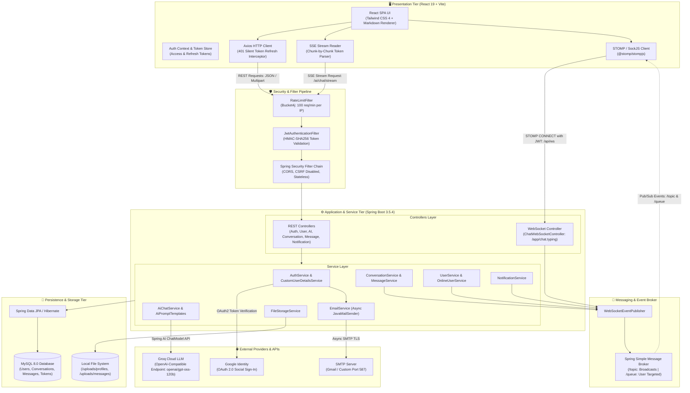
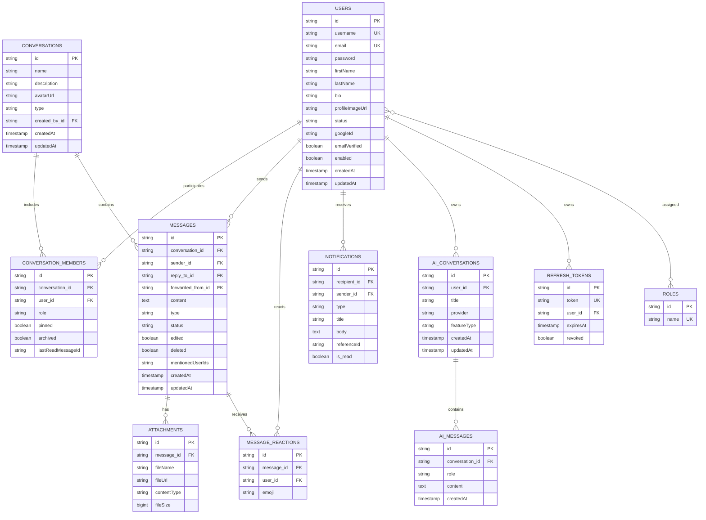

# AI Chat Application

An intelligent, full-stack conversational platform engineered with a Spring Boot 3 backend and a React 19 single-page frontend. The application addresses the need for secure, responsive, and persistent conversational AI by coupling low-latency streaming interactions with enterprise-ready user authentication, database persistence, and real-time WebSocket communication. Powered by Spring AI integrated with Groq's high-speed LLM inference, it delivers responsive markdown-formatted AI responses alongside complete chat and user lifecycle management.

---

## ✨ Features

- **AI-Powered Conversations**: Interactive multi-turn chat assistant with conversation persistence and contextual memory across session exchanges.
- **Server-Sent Events (SSE) Streaming**: Low-latency token-by-token streaming of AI responses (`/api/ai/chat/stream`) with automatic fallback to standard HTTP POST.
- **Contextual Feature Prompts**: Built-in specialized prompt templates for summarization, code explanation, resume reviews, interview preparation, and quick reply suggestions.
- **Automatic Conversation Titling**: Context-aware chat title generation inferred from the user's initial prompt.
- **Dual Authentication**: Local email/password registration with BCrypt hashing and Google OAuth 2.0 social sign-in.
- **Stateless JWT Security & Token Rotation**: Short-lived JWT access tokens paired with database-backed, revocable refresh tokens and automated silent renewal on the frontend.
- **Role-Based Access Control (RBAC)**: Support for `ROLE_USER` and `ROLE_ADMIN` roles enforced through Spring Security and method security annotations.
- **Real-Time WebSocket Messaging**: STOMP over SockJS (`/api/ws`) powering real-time chat updates, message reactions, message editing, soft-deletion, and typing indicators.
- **User Presence Tracking**: Real-time broadcast of online and offline statuses via STOMP topics (`/topic/presence`) triggered by WebSocket connection lifecycle events.
- **Conversations & Group Management**: Backend support for direct (1-on-1) and group conversations, member administration, conversation pinning, and archiving.
- **File Uploads & Media Storage**: Local multipart storage supporting profile avatar uploads and chat attachments with configurable size limits (up to 25 MB).
- **Asynchronous Email Services**: Asynchronous notification dispatch using Spring Mail for account verification tokens, password reset links, and login activity alerts.
- **API Rate Limiting**: In-memory token-bucket rate limiting via Bucket4j (100 requests/min default) applied per client IP.
- **Modern Responsive UI**: React 19 interface styled with Tailwind CSS v4, supporting dark/light mode toggling, syntax-highlighted code blocks with copy-to-clipboard functionality, and mobile-friendly collapsible navigation.
- **Interactive API Documentation**: Embedded Swagger UI and OpenAPI 3 specifications available out of the box at `/api/swagger-ui.html`.

---

## 🏗️ Architecture

The application is architectured around a modern, decoupled client-server paradigm. Communication between the frontend Single Page Application (SPA) and the Spring Boot backend is divided across three distinct channels:

1. **RESTful APIs (`/api/*`)**: Standard request-response cycles for authentication, profile updates, conversation history queries, file uploads, and notification operations.
2. **Server-Sent Events (`/api/ai/chat/stream`)**: Unidirectional reactive streaming channel that pipes AI token chunks directly from Groq's inference engine to the browser with minimal latency.
3. **STOMP over SockJS (`/api/ws`)**: Bidirectional real-time publish-subscribe channel for instant message delivery, typing indicators, read receipts, and user presence broadcasts.

### System Architecture Diagram



---

## 🛠️ Technology Stack

### Backend

| Layer / Component | Technology | Version | Purpose |
| :--- | :--- | :--- | :--- |
| **Language** | Java | 21 | Core backend programming language (LTS) |
| **Framework** | Spring Boot | 3.5.4 | Web MVC framework, dependency injection, and configuration |
| **AI Integration** | Spring AI (OpenAI Starter) | 1.1.0 | Standardized abstraction to communicate with Groq LLM API |
| **Security** | Spring Security | 3.5.4 | Endpoint authorization, filter chains, and session management |
| **Social Login** | Spring Security OAuth2 Client | 3.5.4 | Google OAuth 2.0 authentication integration |
| **Token Handling** | JJWT (Java JWT) | 0.12.6 | JWT token signing, verification, and claims extraction |
| **Persistence** | Spring Data JPA / Hibernate | 3.5.4 | Object-relational mapping and database abstraction |
| **Database Driver** | MySQL Connector/J | 9.x | Runtime JDBC driver for MySQL persistence |
| **Real-Time Broker** | Spring WebSocket & STOMP | 3.5.4 | Bidirectional messaging, presence tracking, and topic routing |
| **Rate Limiting** | Bucket4j Core | 8.10.1 | Token bucket algorithm for endpoint request throttling |
| **API Docs** | SpringDoc OpenAPI | 2.8.5 | Automated OpenAPI 3.0 documentation and Swagger UI |
| **Object Mapping** | MapStruct | 1.6.3 | Compile-time type-safe DTO-to-entity mapping |
| **Boilerplate** | Project Lombok | 1.18.38 | Boilerplate code reduction (getters, setters, builders) |
| **Email** | Spring Starter Mail | 3.5.4 | Asynchronous JavaMailSender for transactional emails |
| **Testing** | JUnit 5 & H2 Database | 3.5.4 / 2.x | Test framework and in-memory test database |

### Frontend

| Layer / Component | Technology | Version | Purpose |
| :--- | :--- | :--- | :--- |
| **Framework** | React | ^19.2.8 | Declarative component-based user interface |
| **DOM Renderer** | React DOM | ^19.2.8 | React rendering layer for browser DOM |
| **Build Tool** | Vite | ^8.2.0 | Next-generation frontend tooling and development server |
| **Routing** | React Router DOM | ^7.5.0 | Client-side routing and protected route handling |
| **Styling** | Tailwind CSS | ^4.1.3 | Utility-first CSS styling via `@tailwindcss/vite` |
| **HTTP Client** | Axios | ^1.8.4 | Promise-based HTTP client with token refresh interceptors |
| **STOMP Protocol** | @stomp/stompjs | ^7.1.1 | STOMP client over WebSockets for real-time pub/sub |
| **WebSocket Fallback** | sockjs-client | ^1.6.1 | WebSocket browser fallback transport layer |
| **Markdown Parsing** | react-markdown | ^10.1.0 | Renders AI markdown responses into structured HTML |
| **Markdown Tables** | remark-gfm | ^4.0.1 | GitHub Flavored Markdown plugin for tables, strikethrough |
| **Icons** | Lucide React | ^0.487.0 | Clean, consistent icons for chat, navigation, and controls |
| **Code Linting** | Oxlint | ^1.75.0 | High-performance JavaScript/React linter |

### Infrastructure

| Component | Technology | Description |
| :--- | :--- | :--- |
| **Containerization** | Docker | Two-stage build: `maven:3.9.9-alpine` & `eclipse-temurin:21-jre-alpine` |
| **Container User** | Alpine Non-Root User | Runs as unprivileged `appuser` (group `appgroup`) |

---

## 🤖 AI Integration

The AI chat feature is built using **Spring AI (1.1.0)** configured to leverage Groq's OpenAI-compatible chat completion endpoints. This setup delivers fast token generation while adhering to Spring AI's clean abstraction model.

### Communication & Processing Flow

1. **Provider Resolution**: The client dispatches a message containing an optional feature type and provider to `/api/ai/chat` (synchronous) or `/api/ai/chat/stream` (reactive streaming).
2. **Conversation Lookup & History Assembly**: `AiChatService` loads or initializes an `AiConversation` record from the database. It constructs an ordered list of Spring AI `Message` objects:
   - A `SystemMessage` generated dynamically by `AiPromptTemplates` according to the requested feature.
   - Previous conversation exchanges (up to historical message boundaries) alternating between `UserMessage` and `AssistantMessage`.
   - The current `UserMessage`.
3. **Execution via `AiProviderRegistry`**: The service pulls the configured `ChatModel` bean (registered for `OPENAI` backed by the Groq API endpoint) and invokes the model.
4. **Streaming Delivery (Server-Sent Events)**:
   - For `/api/ai/chat/stream`, `chatModel.stream(prompt)` returns a reactive `Flux<ChatResponse>`.
   - The chunks are piped directly to a Spring MVC `SseEmitter` with a 120-second timeout.
   - On completion (`doOnComplete`), the accumulated response is saved as an `AiMessage` in the database.
5. **Chat Titling**: If a conversation has the default name `"New Chat"`, the assistant dynamically generates and saves a concise title based on the first prompt.

### Prompt Templates (`AiPromptTemplates`)

The backend contains pre-tuned system and feature prompts:

| Feature Type | Prompt Objective | Format / Behavioral Constraint |
| :--- | :--- | :--- |
| `DEFAULT` | General conversational assistant | Concise, professional responses in GitHub-flavored Markdown |
| `SUMMARIZE` | Text summarization | Concise, well-structured summaries |
| `CODE_EXPLAIN` | Code explanation | Clear breakdown of logic, mechanics, and usage examples |
| `RESUME_REVIEW` | Career coaching | Constructive and actionable resume feedback |
| `INTERVIEW_PREP`| Technical preparation | Curated interview questions and evaluation criteria |
| `SUGGEST` | Chat reply recommendations | Generates 3 natural, short response options |

---

## 💬 Real-Time Communication

The application integrates real-time capabilities via **Spring WebSocket**, utilizing **STOMP** as the messaging sub-protocol and **SockJS** for transport fallback.

### WebSocket Handshake & Security

1. **Client Handshake**: The frontend connects to the `/api/ws` endpoint using SockJS and `@stomp/stompjs`.
2. **Channel Interception**: `WebSocketAuthInterceptor` intercepts the native STOMP `CONNECT` frame.
3. **JWT Verification**: The interceptor validates the `Authorization: Bearer <token>` header, verifies token validity and expiration, extracts the user ID, and injects a custom `Principal` into the session accessor.
4. **Presence Broadcast**:
   - On successful connection, the user is marked online via `OnlineUserService`, and a `UserPresenceChangedEvent` broadcasts an `"ONLINE"` status.
   - On disconnect (`SessionDisconnectEvent`), the user is marked offline, and an `"OFFLINE"` status is published.

### STOMP Routing & Destinations

- **Application Destination Prefix**: `/app` (routes client messages to `@MessageMapping` handlers)
- **Message Broker Prefixes**: `/topic` (pub/sub broadcast), `/queue` (user-specific point-to-point)

| Destination | Direction | Payload | Description |
| :--- | :--- | :--- | :--- |
| `/app/chat.typing` | Client ➔ Server | `{ conversationId, typing, username }` | Broadcasts user typing status |
| `/topic/conversation/{id}` | Server ➔ Client | `MessageResponse` | Delivers newly created chat messages |
| `/topic/conversation/{id}/update` | Server ➔ Client | `MessageResponse` | Broadcasts message edits and reactions |
| `/topic/conversation/{id}/delete` | Server ➔ Client | `{ messageId }` | Broadcasts message deletion notifications |
| `/topic/conversation/{id}/typing` | Server ➔ Client | `{ userId, username, typing }` | Delivers real-time typing indicators |
| `/topic/conversation/{id}/read` | Server ➔ Client | `{ userId, messageId }` | Delivers message read receipts |
| `/topic/presence` | Server ➔ Client | `{ userId, status }` | Global broadcast of user online/offline transitions |
| `/queue/notifications/{userId}` | Server ➔ Client | `NotificationResponse` | Direct user notifications for messages and mentions |

---

## 🔐 Authentication & Security

Security is implemented using **Spring Security 6** configured for completely stateless session management.

### Key Security Components

- **Stateless JWT Authentication**:
  - `JwtAuthenticationFilter` validates incoming requests bearing an `Authorization: Bearer <token>` header.
  - Access tokens have a default lifetime of 15 minutes (`900000 ms`).
  - Refresh tokens have a default lifetime of 7 days (`604800000 ms`) and are tracked in the `refresh_tokens` database table.
- **Silent Token Rotation**:
  - The frontend Axios client intercepts `401 Unauthorized` responses.
  - Concurrent requests are queued while a single refresh request is dispatched to `/api/auth/refresh`.
  - Upon receiving new tokens, the request queue is replayed without forcing the user to log in again.
- **Google OAuth 2.0 Integration**:
  - Initiated via `/api/oauth2/authorization/google`.
  - Handled by `OAuth2AuthenticationSuccessHandler`, which creates a new user or links an existing account, generates access and refresh tokens, and redirects to `${app.frontend-url}/oauth2/callback?accessToken=...&refreshToken=...`.
- **Password Security**: Passwords are encrypted using BCrypt (`BCryptPasswordEncoder`).
- **Rate Limiting**: `RateLimitFilter` applies Bucket4j token buckets keyed by IP address (`X-Forwarded-For` or `remoteAddr`) to mitigate brute-force and DoS attacks (default: 100 requests/minute).
- **Public vs. Protected Endpoints**:
  - Public: `/api/auth/**`, `/api/oauth2/**`, `/api/login/oauth2/**`, `/api/v3/api-docs/**`, `/api/swagger-ui/**`, `/api/swagger-ui.html`, `/api/ws/**`, `/api/uploads/**`, `/api/error`.
  - Protected: All other endpoints require valid JWT authentication.

---

## 🗄️ Database

Persistence is handled by **MySQL 8.0** in production and development (with an in-memory **H2 Database** configured under `application-test.yml` for testing), managed through **Spring Data JPA** and **Hibernate 6**.

### Persistence Architecture

- **Primary Key Strategy**: All domain entities inherit from [`BaseEntity`](file:///d:/chat_app/app/src/main/java/com/chat/app/entity/BaseEntity.java) which generates non-sequential UUID strings (`GenerationType.UUID`), preventing enumeration attacks across public APIs.
- **Auditing**: Automatic timestamping (`createdAt` and `updatedAt`) is managed transparently via `@EnableJpaAuditing` and Spring Data's `AuditingEntityListener`.
- **Soft Deletion**: Messages implement logical soft-deletion (`deleted = true`), wiping the text content while preserving the timeline thread integrity and reply references.
- **Schema Management**: Hibernate schema validation and migration are configured to `update` automatically on startup (`spring.jpa.hibernate.ddl-auto=update`).

---

### Entity & Schema Breakdown

| Table Name | Entity Class | Primary Responsibility | Key Fields & Relationships |
| :--- | :--- | :--- | :--- |
| `users` | `User` | User identity, authentication credentials, and profile information | UUID, `username` (unique), `email` (unique), `password` (BCrypt), `profileImageUrl`, `status` (ONLINE/OFFLINE), `googleId`, `emailVerified` |
| `roles` | `Role` | System authorization roles | UUID, `name` (`ROLE_USER`, `ROLE_ADMIN`) |
| `user_roles` | N/A (Join Table) | Many-to-many relationship between users and roles | `user_id` (FK), `role_id` (FK) |
| `conversations` | `Conversation` | Direct (1-on-1) and Group chat channels | UUID, `name`, `description`, `avatarUrl`, `type` (`DIRECT`, `GROUP`), `created_by_id` (FK) |
| `conversation_members` | `ConversationMember` | Channel membership, roles, and user chat preferences | Composite unique `(conversation_id, user_id)`, `role` (`ADMIN`, `MEMBER`), `pinned`, `archived`, `lastReadMessageId` |
| `messages` | `Message` | Chat messages exchanged between users | UUID, `conversation_id` (FK), `sender_id` (FK), `content` (TEXT), `type` (`TEXT`, `IMAGE`, `VIDEO`, etc.), `status` (`SENT`, `DELIVERED`, `READ`), `reply_to_id` (FK), `forwarded_from_id` (FK), `edited`, `deleted` |
| `attachments` | `Attachment` | Media attachments linked to chat messages | UUID, `message_id` (FK), `fileName`, `fileUrl`, `contentType`, `fileSize` |
| `message_reactions` | `MessageReaction` | Emoji reactions attached to messages | Unique constraint `(message_id, user_id, emoji)`, `emoji`, `message_id` (FK), `user_id` (FK) |
| `notifications` | `Notification` | System and user event alerts | UUID, `recipient_id` (FK), `sender_id` (FK), `type` (`MESSAGE`, `SYSTEM`, `MENTION`), `title`, `body`, `is_read` |
| `ai_conversations` | `AiConversation` | Isolated user chat sessions with AI assistant | UUID, `user_id` (FK), `title`, `provider` (`OPENAI`), `featureType` (`SUMMARIZE`, `CODE_EXPLAIN`, etc.) |
| `ai_messages` | `AiMessage` | Chronological prompt and completion history in AI chats | UUID, `conversation_id` (FK), `role` (`user`, `assistant`), `content` (TEXT) |
| `refresh_tokens` | `RefreshToken` | Persisted JWT refresh tokens for silent renewal | UUID, `token` (unique), `user_id` (FK), `expiresAt`, `revoked` |
| `email_verification_tokens`| `EmailVerificationToken` | One-time tokens for email address verification | UUID, `token` (unique), `user_id` (FK), `expiresAt`, `used` |
| `password_reset_tokens` | `PasswordResetToken` | One-time tokens for password recovery | UUID, `token` (unique), `user_id` (FK), `expiresAt`, `used` |

---

### Entity-Relationship Diagram (ERD)



---

## 📁 Project Structure

```text
chat_app/
├── app/                                    # Spring Boot Backend
│   ├── Dockerfile                          # Multi-stage container definition
│   ├── pom.xml                             # Maven dependencies and build plugins
│   ├── mvnw / mvnw.cmd                     # Maven wrapper scripts
│   └── src/
│       ├── main/
│       │   ├── java/com/chat/app/
│       │   │   ├── AppApplication.java     # Main application entrypoint
│       │   │   ├── ai/                     # AI registry & prompt templates
│       │   │   │   ├── AiPromptTemplates.java
│       │   │   │   └── AiProviderRegistry.java
│       │   │   ├── config/                 # Security, CORS, RateLimit, OpenAPI
│       │   │   │   ├── AppProperties.java
│       │   │   │   ├── ApplicationConfig.java
│       │   │   │   ├── CorsConfig.java
│       │   │   │   ├── DataInitializer.java
│       │   │   │   ├── OpenApiConfig.java
│       │   │   │   ├── RateLimitFilter.java
│       │   │   │   ├── SecurityConfig.java
│       │   │   │   └── WebMvcConfig.java
│       │   │   ├── controller/             # REST API endpoints
│       │   │   │   ├── AiController.java
│       │   │   │   ├── AuthController.java
│       │   │   │   ├── ConversationController.java
│       │   │   │   ├── MessageController.java
│       │   │   │   ├── NotificationController.java
│       │   │   │   └── UserController.java
│       │   │   ├── dto/                    # Request and response transfer objects
│       │   │   │   ├── request/
│       │   │   │   └── response/
│       │   │   ├── entity/                 # JPA domain models
│       │   │   ├── enums/                  # System enumerations
│       │   │   ├── exception/              # Global exception handlers & errors
│       │   │   ├── mapper/                 # MapStruct interfaces
│       │   │   ├── repository/             # Spring Data JPA repositories
│       │   │   ├── security/               # JWT filters & OAuth handlers
│       │   │   ├── service/                # Business logic & email services
│       │   │   └── websocket/              # STOMP config & event publishers
│       │   └── resources/
│       │       └── application.properties  # Primary application properties
│       └── test/                           # Context loading & test profile
│           ├── java/com/chat/app/AppApplicationTests.java
│           └── resources/application-test.yml
│
└── frontend/                               # React 19 Frontend
    ├── package.json                        # Frontend dependencies & scripts
    ├── vite.config.js                      # Vite config with API proxy & Tailwind
    ├── index.html                          # HTML entry template
    └── src/
        ├── App.jsx                         # App routes & provider configuration
        ├── index.css                       # Global styles & design system tokens
        ├── main.jsx                        # React root bootstrap
        ├── api/                            # Axios client, token handling, endpoints
        │   ├── client.js
        │   ├── config.js
        │   └── services.js
        ├── components/                     # Reusable UI components
        │   ├── AuthLayout.jsx
        │   ├── ChatHeader.jsx
        │   ├── ConversationItem.jsx
        │   ├── EmptyChat.jsx
        │   ├── LoadingDots.jsx
        │   ├── MarkdownRenderer.jsx        # Markdown & syntax highlighter
        │   ├── Message.jsx
        │   ├── MessageInput.jsx
        │   ├── MessageList.jsx
        │   ├── ProtectedRoute.jsx
        │   ├── Sidebar.jsx
        │   ├── ThemeToggle.jsx
        │   └── UserMenu.jsx
        ├── context/
        │   └── AuthContext.jsx             # User authentication state
        ├── hooks/
        │   ├── useAiChat.js                # AI conversation & SSE streaming hook
        │   └── useTheme.js                 # Theme state hook (light/dark)
        ├── pages/                          # Application views
        │   ├── ChatPage.jsx
        │   ├── LoginPage.jsx
        │   ├── OAuth2Callback.jsx
        │   ├── ProfilePage.jsx
        │   └── RegisterPage.jsx
        └── services/
            └── websocket.js                # STOMP client service singleton
```

---

## 🔄 Application Flow

1. **User Authentication**:
   - A user signs up at `/register` or logs in at `/login`. Alternatively, they can authenticate through Google OAuth 2.0 via `/api/oauth2/authorization/google`.
   - On success, the backend returns an access token, a refresh token, and user profile metadata.
2. **Session Initialization**:
   - The frontend stores tokens in `localStorage` and configures Axios request headers.
   - The STOMP client initiates a connection to `/api/ws` with the JWT in the `CONNECT` frame.
   - The user presence is broadcast across `/topic/presence`.
3. **Conversational AI Interaction**:
   - The user opens `/chat` and submits a prompt.
   - An optimistic placeholder message is appended to the message list.
   - A request is dispatched to `/api/ai/chat/stream`.
   - The backend retrieves conversation context, injects the system prompt, and streams response tokens back over Server-Sent Events.
   - The UI updates the assistant message dynamically with markdown and syntax-highlighted code blocks.
4. **Data Persistence**:
   - Upon completion of the stream, the backend persists the full assistant response to `ai_messages` and assigns a title to new conversations.
5. **Real-Time Human-to-Human Chat (Backend-Ready)**:
   - When users exchange messages in direct or group conversations, messages are saved in MySQL, and `WebSocketEventPublisher` broadcasts them to subscribed members over `/topic/conversation/{conversationId}`.

---

## 🚀 Getting Started

### Prerequisites

Ensure you have the following installed on your local machine:

- **Java Development Kit (JDK)**: Version 21
- **Node.js**: Version 18.x or later (along with `npm`)
- **MySQL Server**: Version 8.0 or later
- **Groq API Key**: Obtain a key from the [Groq Console](https://console.groq.com/) for Spring AI inference
- **Google Cloud Console Credentials** *(Optional)*: Required only if testing Google OAuth 2.0 login locally

---

### Clone Repository

```bash
git clone https://github.com/thirumala-n/chat_app.git
cd chat_app
```

---

### Database Setup

1. Start your local MySQL server.
2. Create the target database (or allow Spring Boot's connection string to initialize it automatically via `createDatabaseIfNotExist=true`):

```sql
CREATE DATABASE ai_chat_db CHARACTER SET utf8mb4 COLLATE utf8mb4_unicode_ci;
```

---

### Backend Setup

1. Navigate to the backend directory:

```bash
cd app
```

2. Set the required environment variables in your shell (or create an untracked profile):

```bash
# On Linux/macOS
export DB_HOST=localhost
export DB_PORT=3306
export DB_NAME=ai_chat_db
export DB_USERNAME=root
export DB_PASSWORD=your_mysql_password
export GROQ_API_KEY=your_groq_api_key
export JWT_SECRET=your_minimum_32_character_jwt_secret_key_here

# On Windows (PowerShell)
$env:DB_HOST="localhost"
$env:DB_PORT="3306"
$env:DB_NAME="ai_chat_db"
$env:DB_USERNAME="root"
$env:DB_PASSWORD="your_mysql_password"
$env:GROQ_API_KEY="your_groq_api_key"
$env:JWT_SECRET="your_minimum_32_character_jwt_secret_key_here"
```

3. Run the application using the Maven wrapper:

```bash
# Linux/macOS
./mvnw spring-boot:run

# Windows
.\mvnw.cmd spring-boot:run
```

The backend server starts on port `8080` with context path `/api` (accessible at `http://localhost:8080/api`).

---

### Frontend Setup

1. Open a new terminal and navigate to the frontend directory:

```bash
cd frontend
```

2. Install dependencies:

```bash
npm install
```

3. Start the Vite development server:

```bash
npm run dev
```

The application will be accessible at `http://localhost:5173`. The Vite dev server automatically proxies `/api` requests to `http://localhost:8080`.

---

## 🔑 Environment Variables

The table below describes all configurable environment variables used by the backend and frontend:

| Variable | Target | Purpose | Default / Example |
| :--- | :--- | :--- | :--- |
| `DB_HOST` | Backend | MySQL server host | `localhost` |
| `DB_PORT` | Backend | MySQL port | `3306` |
| `DB_NAME` | Backend | MySQL database name | `ai_chat_db` |
| `DB_USERNAME` | Backend | MySQL username | `root` |
| `DB_PASSWORD` | Backend | MySQL user password | `your_db_password` |
| `GROQ_API_KEY` | Backend | Groq API Key for Spring AI inference | `gsk_your_groq_api_key` |
| `GROQ_MODEL` | Backend | Model identifier on Groq | `openai/gpt-oss-120b` |
| `JWT_SECRET` | Backend | HMAC-SHA secret for JWT signing (≥ 256 bits) | `your_secret_key_min_32_chars` |
| `JWT_ACCESS_EXPIRATION` | Backend | Access token validity in milliseconds | `900000` (15 min) |
| `JWT_REFRESH_EXPIRATION` | Backend | Refresh token validity in milliseconds | `604800000` (7 days) |
| `GOOGLE_CLIENT_ID` | Backend | Google OAuth 2.0 Client ID | `your_google_client_id` |
| `GOOGLE_CLIENT_SECRET` | Backend | Google OAuth 2.0 Client Secret | `your_google_client_secret` |
| `MAIL_HOST` | Backend | SMTP host for emails | `smtp.gmail.com` |
| `MAIL_PORT` | Backend | SMTP port | `587` |
| `MAIL_USERNAME` | Backend | SMTP account username | `your_email@gmail.com` |
| `MAIL_PASSWORD` | Backend | SMTP account password / app password | `your_smtp_app_password` |
| `PORT` / `SERVER_PORT` | Backend | HTTP port for the Spring Boot application | `8080` |
| `CORS_ORIGINS` | Backend | Allowed CORS origins (comma-separated) | `http://localhost:5173,http://localhost:3000` |
| `FRONTEND_URL` | Backend | URL used in verification & reset email links | `http://localhost:5173` |
| `UPLOAD_DIR` | Backend | Local file system directory for uploads | `uploads` |
| `RATE_LIMIT` | Backend | Maximum requests per minute per IP | `100` |
| `VITE_API_URL` | Frontend | Base URL for backend API (optional if proxied) | `/api` |
| `VITE_WS_URL` | Frontend | Base WebSocket URL | `/api/ws` |

---

## 🔌 API Documentation

All REST routes are mapped under the `/api` context path. Interactive Swagger documentation is accessible at `http://localhost:8080/api/swagger-ui.html`.

### 1. Authentication (`/api/auth`)

| Method | Endpoint | Description | Auth Required |
| :--- | :--- | :--- | :--- |
| `POST` | `/api/auth/register` | Register a new user account | No |
| `POST` | `/api/auth/login` | Authenticate with email and password | No |
| `POST` | `/api/auth/refresh` | Exchange a refresh token for a new access token | No |
| `POST` | `/api/auth/logout` | Revoke user refresh tokens and terminate session | Yes (Bearer) |
| `POST` | `/api/auth/forgot-password` | Trigger a password reset email link | No |
| `POST` | `/api/auth/reset-password` | Update password using a valid reset token | No |
| `GET` | `/api/auth/verify-email` | Verify user account email with token | No |

#### Request / Response Example (`POST /api/auth/login`)

**Request:**
```json
{
  "email": "user@example.com",
  "password": "SecretPassword123"
}
```

**Response (HTTP 200):**
```json
{
  "success": true,
  "data": {
    "accessToken": "eyJhbGciOiJIUzI1NiIsInR5cCI6IkpXVCJ9...",
    "refreshToken": "48bf41ce-83b6-455c-b17b-f9d9ca00b65d",
    "tokenType": "Bearer",
    "expiresIn": 900,
    "user": {
      "id": "7b59e51c-4b53-48b4-82a8-a6d1e4e4e941",
      "username": "johndoe",
      "email": "user@example.com",
      "firstName": "John",
      "lastName": "Doe",
      "status": "OFFLINE",
      "emailVerified": true,
      "roles": ["ROLE_USER"]
    }
  }
}
```

---

### 2. AI Assistant (`/api/ai`)

| Method | Endpoint | Description | Auth Required |
| :--- | :--- | :--- | :--- |
| `GET` | `/api/ai/conversations` | Retrieve all AI conversations for current user | Yes (Bearer) |
| `GET` | `/api/ai/conversations/{id}`| Fetch specific AI conversation with full messages | Yes (Bearer) |
| `POST` | `/api/ai/chat` | Send a prompt and receive a JSON AI response | Yes (Bearer) |
| `POST` | `/api/ai/chat/stream` | Stream AI response as Server-Sent Events | Yes (Bearer) |
| `DELETE`| `/api/ai/conversations/{id}`| Delete an AI conversation and its messages | Yes (Bearer) |

#### Request / Response Example (`POST /api/ai/chat`)

**Request:**
```json
{
  "conversationId": "a1b2c3d4-e5f6-7890-abcd-ef1234567890",
  "message": "Explain how Spring Boot handles dependency injection.",
  "featureType": "CODE_EXPLAIN"
}
```

**Response (HTTP 200):**
```json
{
  "success": true,
  "data": {
    "id": "e987c654-b321-4321-fedc-ba0987654321",
    "role": "assistant",
    "content": "Spring Boot utilizes the Spring Framework's Inversion of Control (IoC) container...",
    "createdAt": "2026-10-02T14:30:00Z"
  }
}
```

---

### 3. User Management (`/api/users`)

| Method | Endpoint | Description | Auth Required |
| :--- | :--- | :--- | :--- |
| `GET` | `/api/users/me` | Fetch authenticated user's profile | Yes (Bearer) |
| `PUT` | `/api/users/me` | Update name, bio, or status | Yes (Bearer) |
| `POST` | `/api/users/me/avatar` | Upload new profile image (`multipart/form-data`) | Yes (Bearer) |
| `POST` | `/api/users/me/change-password` | Update account password | Yes (Bearer) |
| `GET` | `/api/users/search` | Search users by username, name, or email | Yes (Bearer) |
| `GET` | `/api/users/online` | Retrieve currently active online users map | Yes (Bearer) |
| `GET` | `/api/users/{userId}/online` | Check whether a specific user is online | Yes (Bearer) |

---

### 4. Conversations (`/api/conversations`)

| Method | Endpoint | Description | Auth Required |
| :--- | :--- | :--- | :--- |
| `GET` | `/api/conversations` | List user's conversations (`?archived=false`) | Yes (Bearer) |
| `GET` | `/api/conversations/search` | Search conversations by name (`?q=term`) | Yes (Bearer) |
| `POST` | `/api/conversations/direct/{userId}` | Get or create a direct conversation | Yes (Bearer) |
| `POST` | `/api/conversations/groups` | Create a new group conversation | Yes (Bearer) |
| `POST` | `/api/conversations/{id}/members` | Add members to an existing group | Yes (Bearer) |
| `DELETE`| `/api/conversations/{id}/members/{mId}` | Remove a member from a group (Admin only) | Yes (Bearer) |
| `PUT` | `/api/conversations/{id}/pin` | Toggle pinned status for a conversation | Yes (Bearer) |
| `PUT` | `/api/conversations/{id}/archive` | Toggle archive status for a conversation | Yes (Bearer) |
| `DELETE`| `/api/conversations/{id}` | Leave or delete a conversation | Yes (Bearer) |

---

### 5. Messages (`/api/messages`)

| Method | Endpoint | Description | Auth Required |
| :--- | :--- | :--- | :--- |
| `GET` | `/api/messages/conversation/{id}` | Paginated list of messages for conversation | Yes (Bearer) |
| `POST` | `/api/messages` | Send a standard chat message | Yes (Bearer) |
| `POST` | `/api/messages/with-attachments` | Send message with files (`multipart/form-data`) | Yes (Bearer) |
| `PUT` | `/api/messages/{id}` | Edit an existing sent message | Yes (Bearer) |
| `DELETE`| `/api/messages/{id}` | Soft-delete a message | Yes (Bearer) |
| `POST` | `/api/messages/{id}/reactions` | Add or toggle an emoji reaction | Yes (Bearer) |
| `POST` | `/api/messages/{id}/forward` | Forward a message to another conversation | Yes (Bearer) |
| `POST` | `/api/messages/read` | Mark messages as read (`?conversationId=&messageId=`) | Yes (Bearer) |
| `GET` | `/api/messages/suggestions` | Fetch quick reply suggestions | Yes (Bearer) |

---

### 6. Notifications (`/api/notifications`)

| Method | Endpoint | Description | Auth Required |
| :--- | :--- | :--- | :--- |
| `GET` | `/api/notifications` | Paginated list of user notifications | Yes (Bearer) |
| `GET` | `/api/notifications/unread-count` | Count of unread notifications | Yes (Bearer) |
| `PUT` | `/api/notifications/{id}/read` | Mark single notification as read | Yes (Bearer) |
| `PUT` | `/api/notifications/read-all` | Mark all user notifications as read | Yes (Bearer) |

---

## 🧪 Testing

The backend includes test configuration leveraging **JUnit 5**, **Spring Boot Test**, and an in-memory **H2 Database** configured via `app/src/test/resources/application-test.yml`.

Automated tests are currently limited. The test suite includes Spring application context loading verification (`AppApplicationTests`). Expanded unit, integration, and frontend E2E tests are planned for future iterations.

To run the backend test suite:

```bash
# From within the /app directory
./mvnw test
```

To run frontend lint verification:

```bash
# From within the /frontend directory
npm run lint
```

---

## 🐳 Docker / Deployment

The repository includes a production-oriented, multi-stage `Dockerfile` (`app/Dockerfile`) configured for secure and memory-conscious container execution.

### Multi-Stage Build Highlights

- **Stage 1 (Builder)**: Uses `maven:3.9.9-eclipse-temurin-21-alpine` to cache dependencies and package the executable JAR.
- **Stage 2 (Runtime)**: Runs on `eclipse-temurin:21-jre-alpine` under a non-root system user (`appuser:appgroup`).
- **Memory Optimizations**: Configured with explicit JVM memory limits (`-Xms128m -Xmx160m`, Serial Garbage Collector, single compilation thread tier) and Hikari connection pool limits (maximum 3 connections) tailored for resource-constrained container tiers (such as Render 512 MiB free instances).

### Building and Running with Docker

1. Build the Docker image:

```bash
docker build -t ai-chat-platform ./app
```

2. Run the container:

```bash
docker run -p 8080:8080 \
  -e DB_HOST=host.docker.internal \
  -e DB_PORT=3306 \
  -e DB_NAME=ai_chat_db \
  -e DB_USERNAME=root \
  -e DB_PASSWORD=your_db_password \
  -e GROQ_API_KEY=your_groq_api_key \
  -e JWT_SECRET=your_jwt_secret_key_minimum_32_characters \
  ai-chat-platform
```

---

## 📸 Screenshots

_Add screenshots of the application here._

---

## 🧠 Engineering Decisions

- **Layered Architecture (Controller-Service-Repository)**: Clean separation of concerns where controllers manage HTTP/WebSocket contracts, services orchestrate business transactions and AI interactions, and Spring Data repositories encapsulate data access.
- **Spring AI with Groq Integration**: Rather than writing custom HTTP integration clients for LLMs, the platform leverages the standardized Spring AI `ChatModel` abstraction, making it trivial to swap or expand model providers while taking advantage of Groq's high throughput.
- **Reactive Streaming via Server-Sent Events (SSE)**: Chat experiences require immediate feedback. The backend bridges Spring AI's reactive `Flux<ChatResponse>` to Spring MVC's `SseEmitter`, enabling incremental token streaming directly to the browser without polling.
- **Stateless Authentication with Sliding Refresh**: Storing state on the server increases memory overhead and impairs horizontal scalability. Access tokens remain stateless in memory, while refresh tokens reside in MySQL to permit instant revocation when needed.
- **Token Bucket Rate Limiting (Bucket4j)**: Protection against abuse is enforced at the filter layer (`RateLimitFilter`) before requests reach controllers or invoke costly LLM endpoints.
- **Auditing and UUID Primary Keys**: By utilizing random UUID keys on `BaseEntity`, the application prevents sequential ID enumeration attacks, while Spring Data JPA's auditing listeners automatically populate creation and modification timestamps.
- **Decoupled Frontend Development with Vite Proxy**: Development productivity is maximized through Vite's local development proxy, avoiding cross-origin issues during development while maintaining full separation between frontend and backend codebases.

---

## 🔮 Future Improvements

The following capabilities represent natural extensions for future releases:

- [ ] **Distributed Message Broker**: Transition the in-memory WebSocket broker to an external RabbitMQ or Redis STOMP broker for multi-instance scaling.
- [ ] **Expanded Test Coverage**: Add comprehensive unit testing with Mockito and integration testing using Testcontainers for MySQL.
- [ ] **Frontend Group Chat UI**: Connect the existing backend group chat and member management endpoints to a dedicated UI view.
- [ ] **Read Receipt Indicators**: Expose delivery and read receipt status checkmarks in the frontend chat bubbles based on existing STOMP read events.
- [ ] **Push Notifications**: Integrate the Web Push API for background notifications when the browser tab is closed.

---

## 👨‍💻 Author

**Nemberu Thirumala**  
B.Tech Computer Science Engineering  
Rajeev Gandhi Memorial College of Engineering and Technology  
GitHub: [@thirumala-n](https://github.com/thirumala-n)  
Repository: [thirumala-n/chat_app](https://github.com/thirumala-n/chat_app)

---

## 📄 License

No license has currently been specified.
